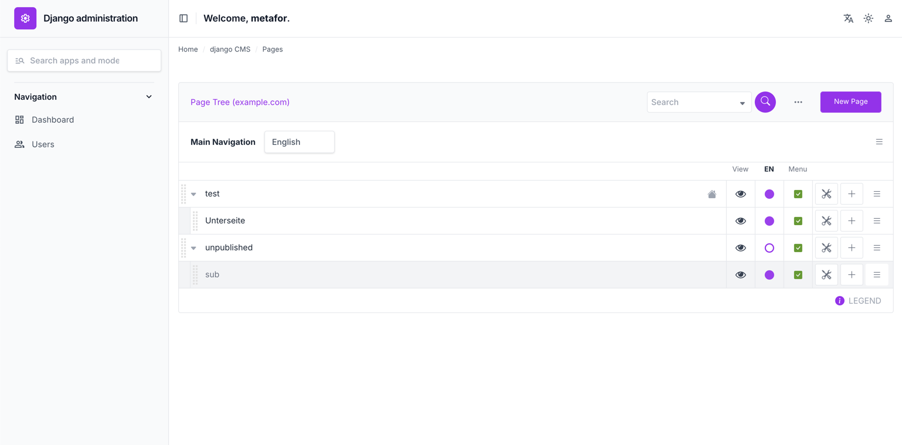
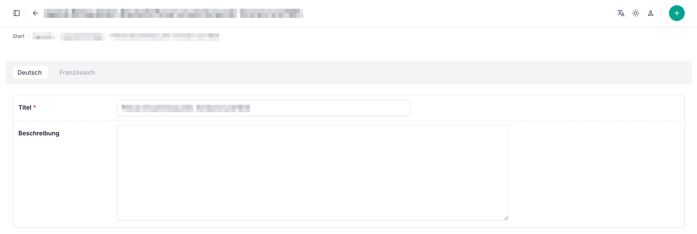

# Django Unfold Extra
[](https://pypi.org/project/django-unfold-extra/) [](https://github.com/metaforx/django-unfold-extra/actions/workflows/ci.yml)

Unofficial extension for Django Unfold Admin. Adds support for django-parler and django-cms to the modern and
clean [Django Unfold](https://github.com/unfoldadmin/django-unfold) admin interface.

## Overview

Django Unfold Extra enhances the Django Unfold admin interface with additional functionality for:

- **django-cms**: Integration with Django CMS 5.0, including Unfold colors in the CMS admin
- **django-parler**: Multilingual support for your Django models
- **versatile-image**: Improved integration with django-versatileimagefield, including preview and ppoi
- **Unfold auto-update**: Styles can be updated from the official Unfold package via npm
- **Theme-Sync**: Use either Unfold or Django CMS switcher to control themes. You can run both at the same time, with or without both controls enabled.




This package maintains the clean, modern aesthetic of Django Unfold while adding specialized interfaces for these
popular Django packages.

It uses unobtrusive template and CSS-styling overrides where possible. As Django CMS uses many '!important' flags, 
pagetree.css had to be rebuilt from sources to remove some conflicting style definitions.

> **Note:** Django CMS support is not fully tested yet. Filer integration is not supported.

## Installation

1. Install the package via pip:
   ```bash
   pip install django-unfold-extra
   ```

2. Add to your INSTALLED_APPS in settings.py:

```python
INSTALLED_APPS = [
    # Unfold theme
    "unfold",
    "unfold_extra",
    # Optional integrations
    "unfold_extra.contrib.cms",
    "unfold_extra.contrib.parler",
    "unfold_extra.contrib.auth",  # you will likely want a custom auth admin
    "unfold_extra.contrib.sites",
]
```

Make sure you have already configured Django Unfold and any optional upstream packages you use
such as django CMS and django-parler.

Add the following to your settings.py:

```python
from django.templatetags.static import static

UNFOLD = {
    "STYLES": [
        lambda request: static("unfold_extra/css/styles.css"),  # additional styles for supported integrations
    ],
    "SCRIPTS": [
        lambda request: static("unfold_extra/js/theme-sync.js"),  # keep django CMS theme in sync with Unfold
    ],
}
CMS_COLOR_SCHEME_TOGGLE = False  # optional: let Unfold be the single theme switch
```

#### Language sync (Unfold ↔ CMS)

To keep the Unfold language switcher and the CMS toolbar/admin in sync, register
`cms_set_language` from `unfold_extra.views` as the `set_language` URL
**before** Django's i18n URLs:

```python
from unfold_extra.views import cms_set_language

urlpatterns = [
    path("i18n/setlang/", cms_set_language, name="set_language"),
    path("i18n/", include("django.conf.urls.i18n")),
    # ...
]
```

When a user switches language via Unfold's sidebar, `cms_set_language` updates
the CMS `UserSettings.language` before the redirect so the CMS toolbar renders
in the same language on the next request.

Add `` and `` from `unfold_extra_tags`
to your base HTML template.
- Enables Unfold admin colors in django CMS
- Syncs the Unfold theme with django CMS (light/dark/auto)

```html

<!DOCTYPE html>
<html>
    <head>
        <title></title>
        <meta name="viewport" content="width=device-width, initial-scale=1.0">
        
        
        
        ...
    </head>
...
</html>
```

## Usage

### django-parler Support

- UnfoldTranslatableAdminMixin
- UnfoldTranslatableStackedAdminMixin
- UnfoldTranslatableTabularAdminMixin
- TranslatableStackedInline, TranslatableTabularInline

#### Example use:

```python
class TranslatableAdmin(UnfoldTranslatableAdminMixin, BaseTranslatableAdmin):
   """custom translatable admin implementation"""

   # ... your code


class MyInlineAdmin(TranslatableStackedInline):
   model = MyModel
   tab = True  # Unfold inline settings
   extra = 0  # django inline settings
```

### django-cms Support

- Theme integration in django admin (partial support in frontend)
- Pagetree
- PageUser, PageUserGroup, GlobalPagePermission when `CMS_PERMISSION = True`
- djangocms-versioning admin template and styling support
- Modal support
- Not supported: Filer

Support is automatically applied. Currently, it does not support customization besides compiling your own unfold_extra
styles.

#### Frontend django CMS support

Add `unfold_extra_tags` to your base HTML template after loading all CSS styles.
This adds additional styles to integrate django CMS with Unfold Admin and exposes `"COLORS"` from Unfold settings on
the public website for authenticated django-cms admin users.

```html

<head>
   ...
   
   
   ...
</head>
```

#### Custom compilation via npm/pnpm

The current frontend scripts live in `unfold_extra/src/package.json`. Run them from
`unfold_extra/src`, for example:

```bash
npm run update:unfold
npm run tailwind:build
npm run tailwind:watch
npm run build:js
```

#### Sync CMS pagetree CSS after upgrading django-cms

The CMS pagetree CSS is vendored with Unfold compatibility patches (e.g. removing the bare `.hidden` selector
that conflicts with Tailwind/Unfold sidebar). After upgrading django-cms, re-sync the patched CSS:

```bash
poetry run python scripts/sync_cms_pagetree.py
```

The script will warn if any patch targets have changed upstream and need manual review.

#### Change colors for Django CMS

You can change the colors for django CMS by editing `unfold_extra/src/css/unfold_extra.css`
or by updating the Unfold colors in `settings.py`.

1. Change into `unfold_extra/src`
2. Fetch the latest Unfold version using `npm run update:unfold`
3. Rebuild styles with `npm run tailwind:build` or use `npm run tailwind:watch` while iterating

```css
html:root {
   --dca-light-mode: 1;
   --dca-dark-mode: 0;
   --dca-white: theme('colors.white');
   --dca-black: theme('colors.black');
   --dca-shadow: theme('colors.base.950');
   --dca-primary: theme('colors.primary.600');
   --dca-gray: theme('colors.base.500');
   --dca-gray-lightest: theme('colors.base.100');
   --dca-gray-lighter: theme('colors.base.200');
   --dca-gray-light: theme('colors.base.400');
   --dca-gray-darker: theme('colors.base.700');
   --dca-gray-darkest: theme('colors.base.800');
   --dca-gray-super-lightest: theme('colors.base.50');

   --active-brightness: 0.9;
   --focus-brightness: 0.95;
}


html.dark {
   --dca-light-mode: 0;
   --dca-dark-mode: 1;
   --dca-white: theme('colors.base.900');
   --dca-black: theme('colors.white');
   --dca-primary: theme('colors.primary.500');
   --dca-gray: theme('colors.base.300') !important;
   --dca-gray-lightest: theme('colors.base.700');
   --dca-gray-lighter: theme('colors.base.600');
   --dca-gray-light: theme('colors.base.400');
   --dca-gray-darker: theme('colors.base.200');
   --dca-gray-darkest: theme('colors.base.100');
   --dca-gray-super-lightest: theme('colors.base.800');

   --active-brightness: 2;
   --focus-brightness: 1.5;
}
```


### Versatile Image Support

- Improved unfold integration via CSS only.

### Django Auth, Sites

- Adds Unfold-based admin registrations for `django.contrib.auth` and `django.contrib.sites`.

This is for personal use. You likely want to customize this. 
