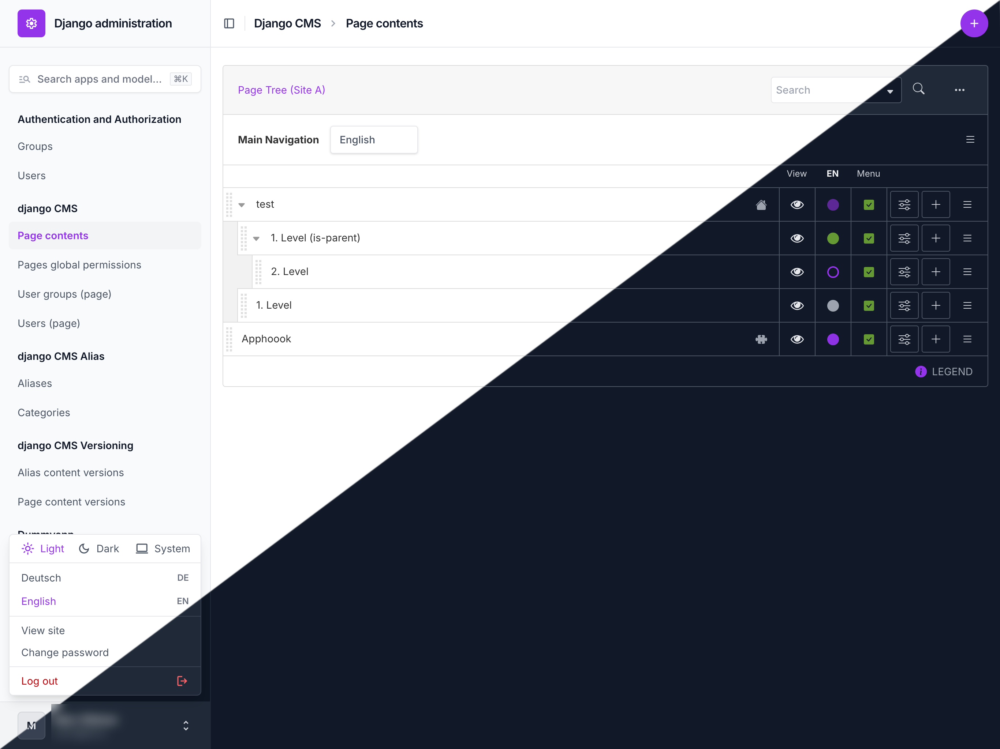
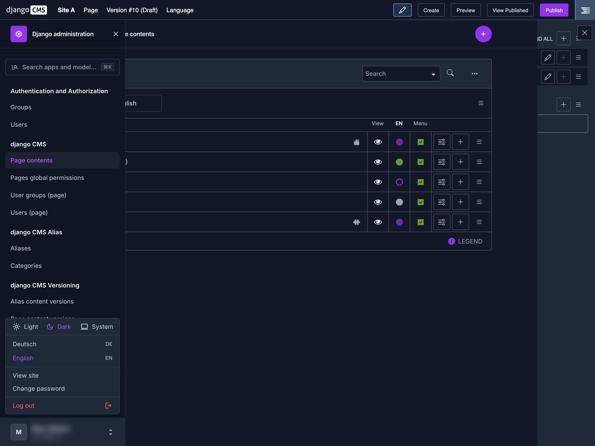
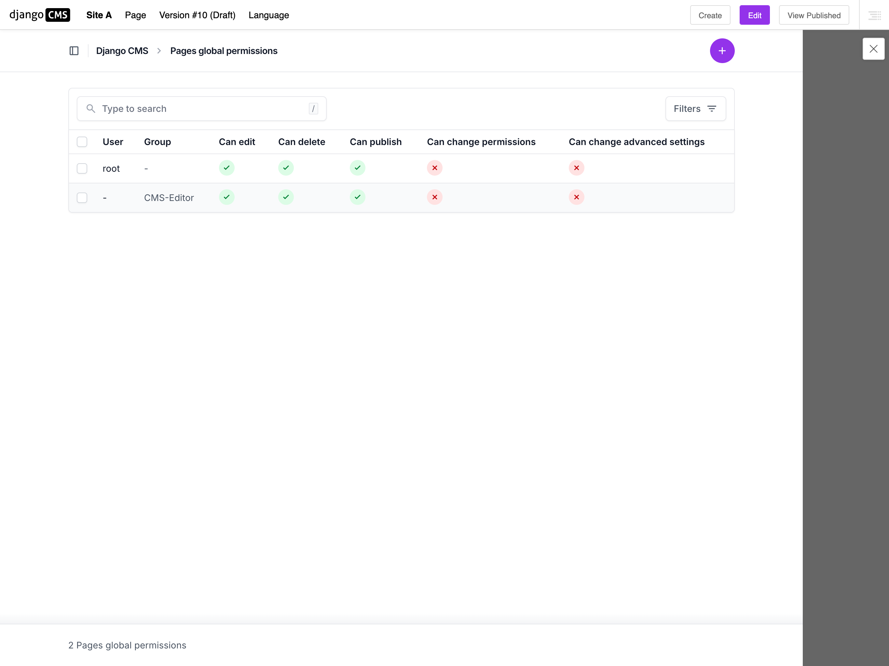
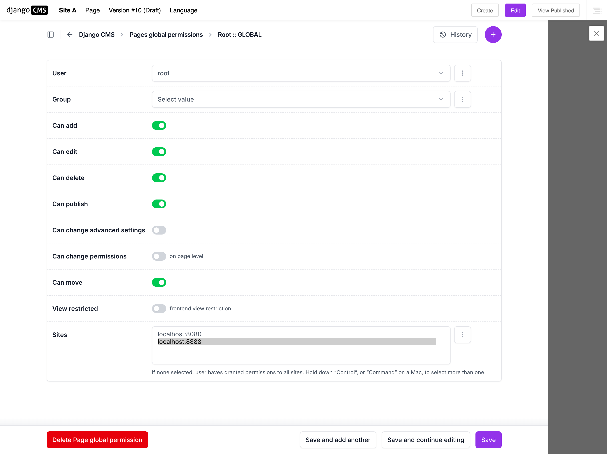
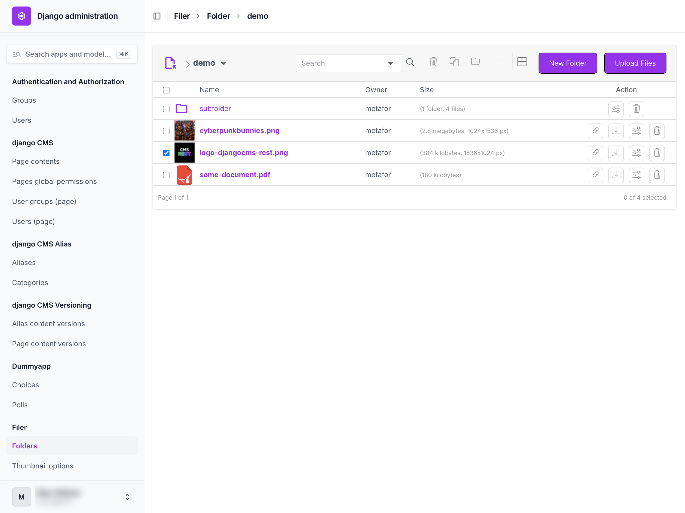
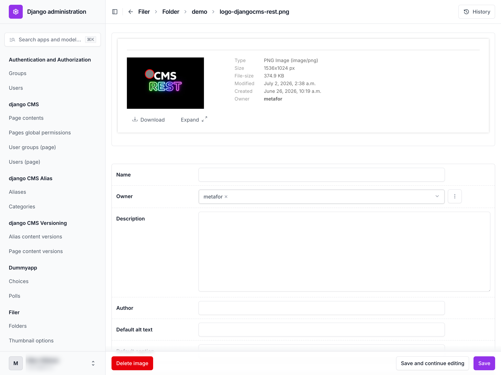
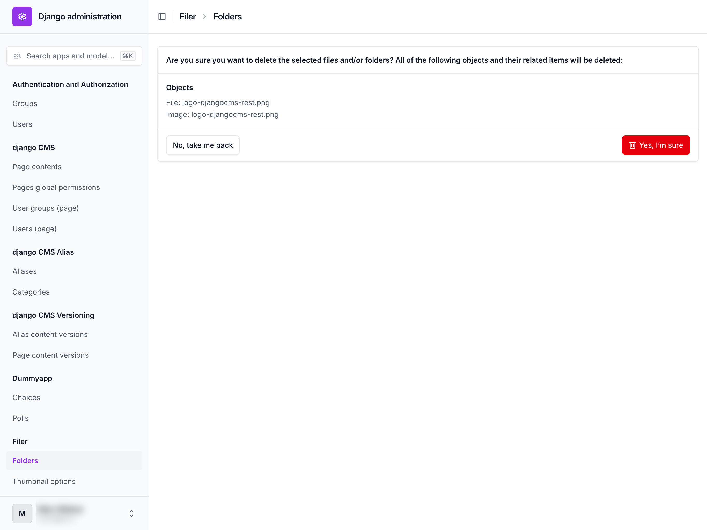
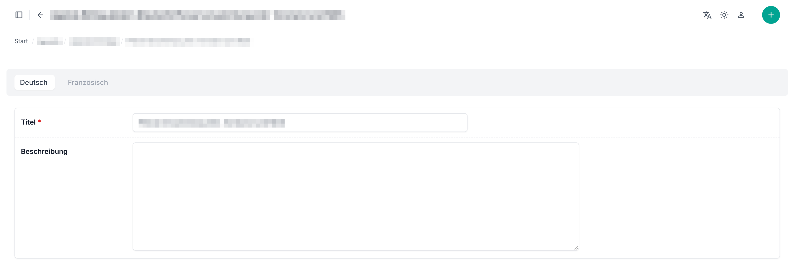

# Django Unfold Extra
[](https://pypi.org/project/django-unfold-extra/) [](https://github.com/metaforx/django-unfold-extra/actions/workflows/ci.yml)

Unofficial extension for [Django Unfold](https://github.com/unfoldadmin/django-unfold) admin. Adds support for `Django CMS` and other common django packages.

Re-registers their admin with Unfold-styled admin classes, forms and widgets, so they keep the clean, modern aesthetic of Django Unfold. It uses unobtrusive template and CSS-styling overrides where possible.

## Features
- django CMS 5.0 support: page tree, page admin, permissions, plugins and versioning
- django-filer: full Unfold integration, including the file and image picker widgets (`[filer]` extra)
- django-parler: multilingual support for your Django models
- django-versatileimagefield: improved integration, including preview and ppoi
- Theme sync: drive the theme from the Unfold or the django CMS switcher, or both at the same time
- Unfold auto-update: styles can be updated from the official Unfold package via npm
- Combines with the non-mandatory [django-unfold-modal](https://github.com/metaforx/django-unfold-modal) package for a unified admin experience

## Requirements

- Python 3.12+
- django-unfold 0.92+
- django-cms 5.0.9+ (<5.1)
- django-parler 2.3+
- django-filer 3.0+ and djangocms-link 5.0+ for the optional `[filer]` / `[link]` extras

## Screenshots

| django CMS edit mode                                | django CMS page permissions in the sideframe                                    |
|-------------------------------------------------------|-----------------------------------------------------------------------------------|
|  |         |

| django CMS page permissions form                                             | django-filer directory listing                                          |
|--------------------------------------------------------------------------------|---------------------------------------------------------------------------|
|  |  |

| django-filer image change form                                          | django-filer delete confirmation                                          |
|--------------------------------------------------------------------------|----------------------------------------------------------------------------|
|  |  |

> **Note:** This package is already used in production but expect additional implementation work. I suggest using it if most of your cms plugins are custom-built.

## Installation

1. Install the package via pip:
   ```bash
   pip install django-unfold-extra
   ```

2. Add to your INSTALLED_APPS in settings.py:

```python
INSTALLED_APPS = [
    # Unfold theme
    "unfold",
    "unfold_extra",
    # Optional integrations
    "unfold_extra.contrib.cms",
    "unfold_extra.contrib.parler",
    "unfold_extra.contrib.auth",  # you will likely want a custom auth admin
    "unfold_extra.contrib.sites",
    "unfold_extra.contrib.filer",  # must come before "filer"
]
```

Make sure you have already configured Django Unfold and any optional upstream packages you use
such as django CMS and django-parler.

### Basic configuration

Add the shared styles integration to your `settings.py`:

```python
from django.templatetags.static import static

UNFOLD = {
    "STYLES": [
        lambda request: static("unfold_extra/css/styles.css"),  # additional styles for supported integrations
    ],
}
```

## Usage

### Integrations

#### django-parler Support

- UnfoldTranslatableAdminMixin
- UnfoldTranslatableStackedAdminMixin
- UnfoldTranslatableTabularAdminMixin
- TranslatableStackedInline, TranslatableTabularInline



##### Example use:

```python
class TranslatableAdmin(UnfoldTranslatableAdminMixin, BaseTranslatableAdmin):
   """custom translatable admin implementation"""

   # ... your code


class MyInlineAdmin(TranslatableStackedInline):
   model = MyModel
   tab = True  # Unfold inline settings
   extra = 0  # django inline settings
```

#### Versatile Image Support

- Improved unfold integration via CSS only.

#### django-filer Support

- Full Unfold integration, including the `FilerFileField` / `FilerImageField` picker widgets.

Install with the extra and list the app **before** `filer` so it can shadow
filer's templates and static files:

```bash
pip install django-unfold-extra[filer]
```

```python
INSTALLED_APPS = [
    # ...
    "unfold_extra.contrib.filer",
    "filer",
]
```

#### Django Auth, Sites

- Adds Unfold-based admin registrations for `django.contrib.auth` and `django.contrib.sites`.

## CMS Integration

### Features

Unfold support for all common Django CMS admin pages and plugins including:

- **Page tree**: Unfold-styled pagetree, with an optional "New Page" button in the Unfold header and a language switcher
- **Page & PageContent admin**: change forms with tabbed fieldsets, plus modal, sideframe, and popup contexts
- **Permissions**: `PageUser`, `PageUserGroup` and `GlobalPagePermission` admin, with page-permission and view-restriction inlines
- **CMS User Settings**
- **djangocms-versioning**: versioning admin, grouper form, version action buttons, and the versioned page change form
- **Custom plugins**: `UnfoldCMSPluginBase` with `UnfoldStackedInline` / `UnfoldTabularInline` and `cms_widget_overrides`
- **djangocms-link**: drop-in Unfold-styled `LinkPlugin` covering the link MultiWidget and the attributes field (`[link]` extra)
- **djangocms-alias**: Unfold-styled alias, category and alias content admin, the Alias plugin form and "Create Alias" popup, plus the usage and delete listings

As Django CMS uses many `!important` flags, a small override stylesheet is loaded after the CMS pagetree CSS to win
back the conflicting declarations. Further customization is possible by compiling your own unfold_extra styles.

### Configuration

Add the django CMS-specific settings to your `settings.py`:

```python
   # ...
    "unfold_extra.contrib.cms",  # required to patch template loading order
    "unfold",
   # ...
```

```python
from django.templatetags.static import static

UNFOLD = {
    "STYLES": [
        lambda request: static("unfold_extra/css/styles.css"),  # additional styles for supported integrations
    ],
    "SCRIPTS": [
        lambda request: static("unfold_extra/js/theme-sync.js"),  # keep django CMS theme in sync with Unfold
    ],
}
```

Optional: let Unfold be the single theme switch and hide theme toggle of Django CMS in toolbar.

```python
CMS_COLOR_SCHEME_TOGGLE = False #default option
```

Optional: move the CMS "New Page" button into Unfold's header. Set this to
`False` to keep the button in the CMS pagetree body. Default of Django CMS.

```python
UNFOLD_CMS_HEADER_ADD_BUTTON = True #default option
```

### Base Template Integration

Add `` and `` from `unfold_extra_tags`
to your base HTML template.

- Enables Unfold admin colors in django CMS
- Syncs the Unfold theme with django CMS (light/dark/auto)
- Adds Unfold-styled django CMS plugin admin support

```html

<!DOCTYPE html>
<html>
    <head>
        <title></title>
        <meta name="viewport" content="width=device-width, initial-scale=1.0">
        
        
        
        ...
    </head>
...
</html>
```

### Language Sync (Unfold ↔ CMS)

To keep the Unfold language switcher and the CMS toolbar/admin in sync, register
`cms_set_language` from `unfold_extra.views` as the `set_language` URL
**before** Django's i18n URLs:

```python
from unfold_extra.views import cms_set_language

urlpatterns = [
    path("i18n/setlang/", cms_set_language, name="set_language"),
    path("i18n/", include("django.conf.urls.i18n")),
    # ...
]
```

When a user switches language via Unfold's sidebar, `cms_set_language` updates
the CMS `UserSettings.language` before the redirect so the CMS toolbar renders
in the same language on the next request.

### CMS Plugins With Unfold Styling

For the general django CMS plugin model, see the official guide:
https://docs.django-cms.org/en/stable/how_to/09-custom_plugins.html

This package only changes the admin side:
- use `UnfoldCMSPluginBase` instead of `CMSPluginBase`
- use `UnfoldStackedInline` or `UnfoldTabularInline` for plugin inlines


```python
# cms_plugins.py
from unfold_extra.contrib.cms.plugins import UnfoldCMSPluginBase
from .models import HeroPluginModel

@plugin_pool.register_plugin
class HeroPlugin(UnfoldCMSPluginBase):
    model = HeroPluginModel
    name = _("Hero")
    render_template = "plugins/hero.html"
```

Most Unfold/Django admin edit options also work on plugins, including
`compressed_fields`, `fieldsets`, `readonly_fields`, `autocomplete_fields`,
`raw_id_fields` lookup popups, `radio_fields`, and `formfield_overrides`.

Use `cms_widget_overrides` when you need to replace plugin form widgets that
should use Unfold-compatible widgets:

```python
from unfold_extra.contrib.cms.plugins import UnfoldCMSPluginBase


class MyPlugin(UnfoldCMSPluginBase):
    cms_widget_overrides = {
        **UnfoldCMSPluginBase.cms_widget_overrides,
        SomeField: MyCustomWidget,
    }
```

See Unfold docs:
- https://unfoldadmin.com/docs/configuration/modeladmin/
- https://unfoldadmin.com/docs/tabs/fieldsets/

### Page Select Widget

Unfold-styled replacements for django CMS's `PageSelectWidget`:

- `UnfoldPageSelectWidget` — use in regular admin forms and CMS plugin forms.
- `UnfoldPageSelectInlineWidget` — use in Django admin inlines. Django admin's
  inline cloning leaves `__prefix__` inside the widget's JSON config; this
  variant ships a small JS patch so the site/page change handler binds to
  dynamically added rows.

```python
from cms.forms.fields import PageSelectFormField
from unfold_extra.contrib.cms.widgets import (
    UnfoldPageSelectInlineWidget,
    UnfoldPageSelectWidget,
)


class MyInlineForm(forms.ModelForm):
    page = PageSelectFormField(widget=UnfoldPageSelectInlineWidget())
```

### djangocms-link Plugin Support

[`djangocms-link`](https://github.com/django-cms/djangocms-link)
To use DjangoCMS Link Plugin with the Unfold theme for Django CMS, it must be registered with customized widgets that support Unfold styling. 
All functions remain intact.

```python
INSTALLED_APPS = [
    # ...
    "djangocms_link",
    "unfold_extra.contrib.djangocms_link",  # after djangocms_link
]
```

Install unfold extra with link support:

```bash
pip install "django-unfold-extra[link]"
```

> The `[link]` extra pulls in `django-filer` because djangocms-link's migrations
> import it (even if you never use `file_link`). Add `filer` to your
> `INSTALLED_APPS` so the migrations can run.
>
> Advanced: drop filer by shadowing those migrations via `MIGRATION_MODULES` —
> won't work on databases already migrated with filer.

### Frontend django CMS Support

Add `unfold_extra_tags` to your base HTML template after loading all CSS styles.
This adds additional styles to integrate django CMS with Unfold Admin and exposes `"COLORS"` from Unfold settings on
the public website for authenticated django-cms admin users.

```html

<head>
   ...
   
   
   ...
</head>
```

### Custom Compilation via npm

The current frontend scripts live in `unfold_extra/src/package.json`. Run them from
`unfold_extra/src`, for example:

```bash
npm run update:unfold
npm run tailwind:build
npm run tailwind:watch
npm run build:js
```

### Change Colors for Django CMS

Configure colors through Unfold in `settings.py` using `UNFOLD["COLORS"]`.
This is the minimal and recommended way to align the admin theme, including the
shared base, primary, and font colors used by this package.

```python
UNFOLD = {
    "COLORS": {
        "base": {
            "50": "oklch(98.5% 0.002 247.839)",
            "100": "oklch(96.7% 0.003 264.542)",
            "200": "oklch(92.8% 0.006 264.531)",
            "300": "oklch(87.2% 0.009 258.338)",
            "400": "oklch(71.4% 0.019 261.325)",
            "500": "oklch(55.1% 0.023 264.364)",
            "600": "oklch(44.6% 0.026 256.802)",
            "700": "oklch(37.3% 0.031 259.733)",
            "800": "oklch(27.8% 0.030 256.848)",
            "900": "oklch(21.0% 0.032 264.665)",
            "950": "oklch(13.0% 0.027 261.692)",
        },
        "primary": {
            "50": "oklch(97.7% 0.014 308.299)",
            "100": "oklch(94.6% 0.033 307.174)",
            "200": "oklch(90.2% 0.060 306.703)",
            "300": "oklch(82.7% 0.108 306.383)",
            "400": "oklch(72.2% 0.177 305.504)",
            "500": "oklch(62.7% 0.233 303.900)",
            "600": "oklch(55.8% 0.252 302.321)",
            "700": "oklch(49.6% 0.237 301.924)",
            "800": "oklch(43.8% 0.198 303.724)",
            "900": "oklch(38.1% 0.166 304.987)",
            "950": "oklch(29.1% 0.143 302.717)",
        },
        "font": {
            "subtle-light": "var(--color-base-500)",
            "subtle-dark": "var(--color-base-400)",
            "default-light": "var(--color-base-600)",
            "default-dark": "var(--color-base-300)",
            "important-light": "var(--color-base-900)",
            "important-dark": "var(--color-base-100)",
        },
    },
}
```

For CMS-specific theme adjustments beyond the shared Unfold palette, update the
frontend assets in `unfold_extra/src`.

See the official Unfold docs:
- Settings options: https://unfoldadmin.com/docs/configuration/settings/
- Customizing Tailwind stylesheet: https://unfoldadmin.com/docs/styles-scripts/customizing-tailwind/

This is for personal use. You likely want to customize this. 
